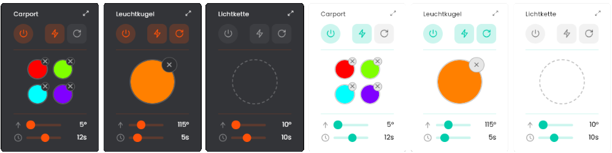

# 🎨 Farbeverlauf (Color Loop)

Das Modul bietet die Möglichkeit, einen automatischen Farbverlauf bzw. einen Farbwechsel zu aktivieren. Sobald er aktiviert ist, läuft eine kontinuierliche Schleife durch verschiedene Farben, die sich fortlaufend wiederholt.  

## Inhaltverzeichnis

1. [Funktionsumfang](#user-content-1-funktionsumfang)
2. [Voraussetzungen](#user-content-2-voraussetzungen)
3. [Installation](#user-content-3-installation)
4. [Einrichtung](#user-content-4-einrichtung)
5. [Statusvariablen](#user-content-5-statusvariablen)
6. [Darstellungen](#user-content-6-darstellungen)
7. [Visualisierung](#user-content-7-visualisierung)
8. [Befehlsreferenz](#user-content-8-befehlsreferenz)
9. [Versionshistorie](#user-content-9-versionshistorie)

### 1. Funktionsumfang

Die Idee für das Modul stammt aus der Philips HUE App, welche ein Farbschleifen-Funktionalität bereitstellt.  
Durch den Umstieg auf Zigbee2Mqtt und den Wegfall des HUE-Gateways und den damit verbunden Wegfall der HUE-App fehlte mir dieser nette Effekt.
Im Endeffekt versucht das Modul diesen Effekt nachzubilden.  

* Bilden einer Gruppe über mehrere Leuchtmittel hinweg
* Starten und stoppen der Schleife über einen hinterlegten Gruppenschalter (z.B. Z2M Group Status)
* Festlegen der Startfarbe pro Leuchte oder direktes Aufsetzen auf aktuellen Farbwert der Leuchte
* Steuerung der Funktionalität über die Visualisierung
  * Aktivieren bzw. Deaktivieren der Funktionalität (inkl. Autostart und Fortfahren)
  * Möglichkeit die Startfarbe pro Leuchtmittel festzulegen
  * Steuerung der Schrittweite und Übergangsgeschwindigkeit

Gute Effekte kann man erzielen bei kleiner Schrittweite (5) und einem sehr langsamen Übergang (12sek)

### 2. Voraussetzungen

* Symcon ab Version 8.1
* Getestet mit verschiedenen Zigbee Leuchtmitteln

### 3. Installation

* Über den Modul Store das Modul _Farbschleife_ installieren.
* Alternativ über das Modul Control folgende URL hinzufügen.  
`https://github.com/Wilkware/ColorLoop` oder `git://github.com/Wilkware/ColorLoop.git`

### 4. Einrichtung

* Unter 'Instanz hinzufügen' ist das _Farbschleife_-Modul unter dem Hersteller '(Geräte)' aufgeführt.

__Konfigurationsseite__:

Einstellungsbereich:

> 🎚️ Schaltung ...

Name                            | Beschreibung
------------------------------- | -----------------------------------------------------------------
Schaltervariable                | Die Schaltvariable, welche als Indikator für den Schaltzustand (An/Aus) der ganzen Leuchtgruppe dient.

> 💡 Geräte ...

Name                            | Beschreibung
------------------------------- | -----------------------------------------------------------------
Leuchtmittel (Liste)            | Alle Geräte, welche an der Farbschleife beteiligt seien sollen
-- Statusvariable               | Statusvariable des Leuchtmittels, welche die Farbe abbildet. Muss sich über RequestAction steuern lassen und das Profil _~HexColor_ oder Darstellung _Farbe_ besitzen.
-- Startfarbe                   | Farbwert mit dem die Farbschleife beginnen soll. Die Farbauswahl 'Transparent' bewirkt die Verwendung des aktuell eingestellten Farbcodes des Leuchtmittels als Startfarbe.
-- Leuchtenname                 | Der Leuchtenname hilft in der Visualisierung zur Identifizierung der einzelnen Leuchtmittel.

> ⚙️ Erweiterte Einstellungen ...

Name                            | Beschreibung
------------------------------- | -----------------------------------------------------------------
Sollen Startfarben in der Visualisierung bearbeitbar sein? | Ermöglicht die Bearbeitung der Startfarbe über die Visualisierung (Syncron zur Modulkonfiguration).

### 5. Statusvariablen

Die Statusvariablen werden automatisch angelegt. Das Löschen einzelner kann zu Fehlfunktionen führen.

Name                 | Typ     | Beschreibung
-------------------- | ------- | ------------------------------
Aktiv                | Boolean | Schalter für Aktivierung oder Deaktivierung der Farbschleife
Schrittweite         | Integer | Auswahl, wie groß die Farbänderungsschritte erfolgen sollen
Übergang             | Integer | Auswahl, wie schnell der einzelne Farbwechsel erfolgen soll
Autostart            | Boolean | Schalter, ob Farbschleife automatisch starten soll wenn Leuchtgruppe angeschaltet wird.
Fortsetzen           | Boolean | Schalter, ob Farbschleife mit den aktuellen Farbwerten der Leuchtmittel fortgesetzt werden soll.

### 6. Darstellungen

Die Darstellungen werden direkt an den Statusvariablen hinterlegt, es werden keine Profile angelegt.

Variable             | Darstellung   | Werte
-------------------- | ------------- | ------------------------------
Aktiv                | Schalter      | An / Aus
Schrittweite         | Schieberegler | 5 – 355° (Schrittweite 5)
Übergang             | Schieberegler | 2 – 20 s (Schrittweite 1)
Autostart            | Schalter      | An / Aus
Fortsetzen           | Schalter      | An / Aus

### 7. Visualisierung

Man kann sowohl das gesamte Modul (HTML-SDK Support) als auch nur die Statusvariablen direkt in der Visualisierung verlinken.

_HINWEIS:_ Das Bearbeiten der Farben erfordert dessen Aktivierung unter _'Erweiterte Einstellungen'_.

### 8. Befehlsreferenz

Das Modul stellt keine direkten Funktionsaufrufe zur Verfügung.

### 9. Versionshistorie

v2.0.20260610
* _NEU_: Support für TileVisu (Kachel-Visualisierung)
* _NEU_: Kompatibilität auf IPS 8.1 vereinheitlicht
* _NEU_: Umstellung auf Strict-Modus (IPSModuleStrict)
* _NEU_: Umstellung auf Darstellungen
* _NEU_: Modulversion wird in Quellcodesektion angezeigt
* _FIX_: Modulkonfiguration überarbeitet und vereinheitlicht
* _FIX_: Interne Bibliotheken und Konfiguration überarbeitet und vereinheitlicht

v1.1.20240224

* _NEU_: Farbschleife kann automatisch mit Gerät eingeschaltet werden
* _NEU_: Farbschleife kann bei Wiedereinschalten auf letzte Farbwerte aufsetzen
* _FIX_: Interne Bibliotheken überarbeitet
* _FIX_: Internes Deployment überarbeitet

v1.0.20230728

* _NEU_: Initialversion

## Entwickler

Seit nunmehr über 10 Jahren fasziniert mich das Thema Haussteuerung. In den letzten Jahren betätige ich mich auch intensiv in der Symcon Community und steuere dort verschiedenste Skript und Module bei. Ihr findet mich dort unter dem Namen @pitti ;-)

## Spenden

Die Software ist für die nicht kommerzielle Nutzung kostenlos, über eine Spende bei Gefallen des Moduls würde ich mich freuen.

## Lizenz

Namensnennung - Nicht-kommerziell - Weitergabe unter gleichen Bedingungen 4.0 International

